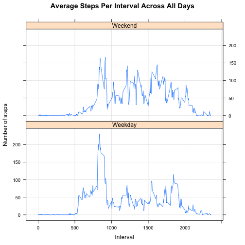

Data Analysis on the Activity Dataset
========================================================

The following describes the data analysis done on the [activity data set](https://d396qusza40orc.cloudfront.net/repdata%2Fdata%2Factivity.zip) which has been collected between October and November 2012 from activities done by an anonymous individual. It contains the csv file which I saved as "activity.csv".

The data set was stored in a CSV file and  contains 17,568 observations with the following variables:
- steps : # of steps the individual did within the 5 minute interval
- date : when the data was collected
- interval : the id for the 5 min interval collected

Missing data are  denoted as **NA**.

# Reproducible Research: Peer Assessment 1


## Loading and preprocessing the data
1. Read the data using **read.csv()**.
2. Convert date field values to Date class (date is in format: **YYYY-MM-DD**) using **as.Date()**. But, make sure that the values are treated as strings first using **as.character()**.
3. Convert the steps and interval field values to Numeric class using **as.numeric()**. But, make sure that the values are treated as strings first using **as.character()**.
4. Display a summary to quickly check out the data.


```r
data <- read.csv("activity.csv", header = T)
data$date <- as.Date(as.character(data$date), "%Y-%m-%d")
data$steps <- as.numeric(as.character(data$steps))
data$interval <- as.numeric(as.character(data$interval))
summary(data)
```

```
##      steps            date               interval   
##  Min.   :  0.0   Min.   :2012-10-01   Min.   :   0  
##  1st Qu.:  0.0   1st Qu.:2012-10-16   1st Qu.: 589  
##  Median :  0.0   Median :2012-10-31   Median :1178  
##  Mean   : 37.4   Mean   :2012-10-31   Mean   :1178  
##  3rd Qu.: 12.0   3rd Qu.:2012-11-15   3rd Qu.:1766  
##  Max.   :806.0   Max.   :2012-11-30   Max.   :2355  
##  NA's   :2304
```


## What is mean total number of steps taken per day?
1. Use ddply (from the plyr library) to compute the mean, median, and total number of steps taken per day. Remove all rows with steps = **NA** using **complete.cases()**. In addition, remove all rows with 0 steps. Only include the intervals that actually has a positive, non-zero value.
2. Display a histogram of the total number of steps taken per day.
3. Display all the results (mean, median, and sum) steps per day.


```r
library(plyr)
steps <- ddply(data[data$steps > 0 & complete.cases(data), ], .(date), summarize, 
    mean_steps = mean(steps), median_steps = median(steps), sum_steps = sum(steps))
hist(steps$sum_steps, xlab = "Sum of Steps", main = "Histogram of the Total Steps Per Day")
```

 

```r
print(steps)
```

```
##          date mean_steps median_steps sum_steps
## 1  2012-10-02      63.00         63.0       126
## 2  2012-10-03     140.15         61.0     11352
## 3  2012-10-04     121.16         56.5     12116
## 4  2012-10-05     154.58         66.0     13294
## 5  2012-10-06     145.47         67.0     15420
## 6  2012-10-07     101.99         52.5     11015
## 7  2012-10-09     134.85         48.0     12811
## 8  2012-10-10      95.19         56.5      9900
## 9  2012-10-11     137.39         35.0     10304
## 10 2012-10-12     156.59         46.0     17382
## 11 2012-10-13     119.48         45.5     12426
## 12 2012-10-14     160.62         60.5     15098
## 13 2012-10-15     131.68         54.0     10139
## 14 2012-10-16     157.12         64.0     15084
## 15 2012-10-17     152.86         61.5     13452
## 16 2012-10-18     152.36         52.5     10056
## 17 2012-10-19     127.19         74.0     11829
## 18 2012-10-20     125.24         49.0     10395
## 19 2012-10-21      96.93         48.0      8821
## 20 2012-10-22     154.71         52.0     13460
## 21 2012-10-23     101.34         56.0      8918
## 22 2012-10-24     104.44         51.5      8355
## 23 2012-10-25      56.64         35.0      2492
## 24 2012-10-26      77.02         36.5      6778
## 25 2012-10-27     134.92         72.0     10119
## 26 2012-10-28     110.17         61.0     11458
## 27 2012-10-29      80.94         54.5      5018
## 28 2012-10-30     110.33         40.0      9819
## 29 2012-10-31     179.23         83.5     15414
## 30 2012-11-02     143.24         55.5     10600
## 31 2012-11-03     117.46         59.0     10571
## 32 2012-11-05     141.07         66.0     10439
## 33 2012-11-06     100.41         52.0      8334
## 34 2012-11-07     135.61         58.0     12883
## 35 2012-11-08      61.90         42.5      3219
## 36 2012-11-11     132.72         55.0     12608
## 37 2012-11-12     156.01         42.0     10765
## 38 2012-11-13      90.57         57.0      7336
## 39 2012-11-15      20.50         20.5        41
## 40 2012-11-16      89.20         43.0      5441
## 41 2012-11-17     183.83         65.5     14339
## 42 2012-11-18     162.47         80.0     15110
## 43 2012-11-19     117.88         34.0      8841
## 44 2012-11-20      95.15         58.0      4472
## 45 2012-11-21     188.04         55.0     12787
## 46 2012-11-22     177.63         65.0     20427
## 47 2012-11-23     252.31        113.0     21194
## 48 2012-11-24     176.56         65.5     14478
## 49 2012-11-25     140.88         84.0     11834
## 50 2012-11-26     128.30         53.0     11162
## 51 2012-11-27     158.67         57.0     13646
## 52 2012-11-28     212.15         70.0     10183
## 53 2012-11-29     110.11         44.5      7047
```


## What is the average daily activity pattern?
1. Display a time series plot of the 5-minute interval on the x-axis and the average number of steps taken across all days (y-axis). Use the **aggregate()** function.
2. Find the interval with max average steps.


```r
intToSteps <- aggregate(steps ~ interval, data = data, FUN = mean)
plot(intToSteps, type = "l", main = "Average Steps Per Interval Across All Days")
```

 

```r
intWithMaxSteps <- intToSteps[intToSteps$steps == max(intToSteps$steps), ]$interval
print(intWithMaxSteps)
```

```
## [1] 835
```


## Imputing missing values
- Count the # of rows with **NA** step values.


```r
sum(is.na(data))
```

```
## [1] 2304
```


- Devise a strategy for filling in all of the missing values in the dataset. The strategy does not need to be sophisticated. For example, you could use the mean/median for that day, or the mean for that 5-minute interval, etc
** The following uses the mean value of steps across all days per interval to fill missing data **


```r
tmp <- merge(data, intToSteps, by = c("interval"))
missing <- is.na(tmp$steps.x)
tmp[missing, ]$steps.x <- tmp[missing, ]$steps.y
newData <- tmp[, c("date", "interval", "steps.x")]
colnames(newData) <- c("date", "interval", "steps")
```


- Make a histogram of the total number of steps taken each day and Calculate and report the mean and median total number of steps taken per day. Do these values differ from the estimates from the first part of the assignment? What is the impact of imputing missing data on the estimates of the total daily number of steps?
** No, there's not a whole lot of difference. The histogram still looks the same **


```r
library(plyr)
newSteps <- ddply(newData[newData$steps > 0, ], .(date), summarize, mean_steps = mean(steps), 
    median_steps = median(steps), sum_steps = sum(steps))
hist(newSteps$sum_steps, xlab = "Sum of Steps", main = "Histogram of the Total Steps Per Day with New Data")
```

 

```r
print(newSteps)
```

```
##          date mean_steps median_steps sum_steps
## 1  2012-10-01      40.02        37.45     10766
## 2  2012-10-02      63.00        63.00       126
## 3  2012-10-03     140.15        61.00     11352
## 4  2012-10-04     121.16        56.50     12116
## 5  2012-10-05     154.58        66.00     13294
## 6  2012-10-06     145.47        67.00     15420
## 7  2012-10-07     101.99        52.50     11015
## 8  2012-10-08      40.02        37.45     10766
## 9  2012-10-09     134.85        48.00     12811
## 10 2012-10-10      95.19        56.50      9900
## 11 2012-10-11     137.39        35.00     10304
## 12 2012-10-12     156.59        46.00     17382
## 13 2012-10-13     119.48        45.50     12426
## 14 2012-10-14     160.62        60.50     15098
## 15 2012-10-15     131.68        54.00     10139
## 16 2012-10-16     157.12        64.00     15084
## 17 2012-10-17     152.86        61.50     13452
## 18 2012-10-18     152.36        52.50     10056
## 19 2012-10-19     127.19        74.00     11829
## 20 2012-10-20     125.24        49.00     10395
## 21 2012-10-21      96.93        48.00      8821
## 22 2012-10-22     154.71        52.00     13460
## 23 2012-10-23     101.34        56.00      8918
## 24 2012-10-24     104.44        51.50      8355
## 25 2012-10-25      56.64        35.00      2492
## 26 2012-10-26      77.02        36.50      6778
## 27 2012-10-27     134.92        72.00     10119
## 28 2012-10-28     110.17        61.00     11458
## 29 2012-10-29      80.94        54.50      5018
## 30 2012-10-30     110.33        40.00      9819
## 31 2012-10-31     179.23        83.50     15414
## 32 2012-11-01      40.02        37.45     10766
## 33 2012-11-02     143.24        55.50     10600
## 34 2012-11-03     117.46        59.00     10571
## 35 2012-11-04      40.02        37.45     10766
## 36 2012-11-05     141.07        66.00     10439
## 37 2012-11-06     100.41        52.00      8334
## 38 2012-11-07     135.61        58.00     12883
## 39 2012-11-08      61.90        42.50      3219
## 40 2012-11-09      40.02        37.45     10766
## 41 2012-11-10      40.02        37.45     10766
## 42 2012-11-11     132.72        55.00     12608
## 43 2012-11-12     156.01        42.00     10765
## 44 2012-11-13      90.57        57.00      7336
## 45 2012-11-14      40.02        37.45     10766
## 46 2012-11-15      20.50        20.50        41
## 47 2012-11-16      89.20        43.00      5441
## 48 2012-11-17     183.83        65.50     14339
## 49 2012-11-18     162.47        80.00     15110
## 50 2012-11-19     117.88        34.00      8841
## 51 2012-11-20      95.15        58.00      4472
## 52 2012-11-21     188.04        55.00     12787
## 53 2012-11-22     177.63        65.00     20427
## 54 2012-11-23     252.31       113.00     21194
## 55 2012-11-24     176.56        65.50     14478
## 56 2012-11-25     140.88        84.00     11834
## 57 2012-11-26     128.30        53.00     11162
## 58 2012-11-27     158.67        57.00     13646
## 59 2012-11-28     212.15        70.00     10183
## 60 2012-11-29     110.11        44.50      7047
## 61 2012-11-30      40.02        37.45     10766
```


## Are there differences in activity patterns between weekdays and weekends?

For this part the weekdays() function may be of some help here. Use the dataset with the filled-in missing values for this part.

- Create a new factor variable in the dataset with two levels – “weekday” and “weekend” indicating whether a given date is a weekday or weekend day.


```r
newData$day <- weekdays(newData$date)
newData$day[newData$day %in% c("Saturday", "Sunday")] <- "Weekend"
newData$day[!(newData$day %in% c("Weekend"))] <- "Weekday"
head(newData, 10)
```

```
##          date interval steps     day
## 1  2012-10-01        0 1.717 Weekday
## 2  2012-11-23        0 0.000 Weekday
## 3  2012-10-28        0 0.000 Weekend
## 4  2012-11-06        0 0.000 Weekday
## 5  2012-11-24        0 0.000 Weekend
## 6  2012-11-15        0 0.000 Weekday
## 7  2012-10-20        0 0.000 Weekend
## 8  2012-11-16        0 0.000 Weekday
## 9  2012-11-07        0 0.000 Weekday
## 10 2012-11-25        0 0.000 Weekend
```

```r
tail(newData, 10)
```

```
##             date interval steps     day
## 17559 2012-10-06     2355 0.000 Weekend
## 17560 2012-10-24     2355 0.000 Weekday
## 17561 2012-10-15     2355 0.000 Weekday
## 17562 2012-11-11     2355 0.000 Weekend
## 17563 2012-10-16     2355 0.000 Weekday
## 17564 2012-10-07     2355 0.000 Weekend
## 17565 2012-10-25     2355 0.000 Weekday
## 17566 2012-11-03     2355 0.000 Weekend
## 17567 2012-10-08     2355 1.075 Weekday
## 17568 2012-11-30     2355 1.075 Weekday
```


- Make a panel plot containing a time series plot (i.e. type = "l") of the 5-minute interval (x-axis) and the average number of steps taken, averaged across all weekday days or weekend days (y-axis). 


```r
library(lattice)
newIntToSteps <- ddply(newData, .(interval, day), summarize, steps = mean(steps))
xyplot(steps ~ interval | day, newIntToSteps, grid = TRUE, type = "l", xlab = "Interval", 
    ylab = "Number of steps", main = "Average Steps Per Interval Across All Days", 
    layout = c(1, 2))
```

 

